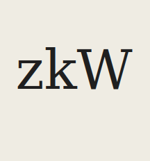

# zkWhistleblower (TS SDK)

<p align="center">
  
</p>

JavaScript/TypeScript helper package for generating inputs, proving, and verifying the `zkWhistleblower` Noir circuit.

## Unstable Release Warning

This package is currently **unstable** and should be treated as pre-release software.

- APIs may change without notice.
- Build outputs and package exports may change between versions.
- Proof formats must match verifier settings exactly (especially Honk `keccak` options).
- Do not use this package in production systems without pinning exact versions and running full integration tests.

## Requirements

- Node.js 22+
- `pnpm` (recommended) or `yarn`
- Circuit artifacts generated in `../target` (run `make compile` from repo root)

## Install

```bash
pnpm install
```

## Build

```bash
pnpm build
```

Watch mode:

```bash
pnpm dev
```

## Output Targets

The package builds two ESM targets:

- Node backend build: `dist/node`
- Browser build: `dist/browser`

`package.json` exports are configured so Node and browser consumers resolve the correct bundle automatically.

## Usage

```ts
import {
  ProofLeakProver,
  generateInputs,
  extractEmailAddresses,
  domainSequence,
  domainInputs,
} from "proof-leak-noir";

const prover = new ProofLeakProver("honk", 4);

const inputParams = {
  extractFrom: true,
  extractTo: true,
  maxHeadersLength: 1024,
  maxBodyLength: 1024,
};

// 1) Build zk-email base inputs from .eml content
const inputs = await generateInputs(emlBuffer, inputParams);

// 2) Build circuit-specific domain inputs
const parsed = extractEmailAddresses(emlBuffer.toString());
const from_domain_sequence = domainSequence(inputs.header.storage, parsed.from.address);
const to_domain_sequence = domainSequence(inputs.header.storage, parsed.to.address);

const plInputs = {
  ...inputs,
  from_domain_sequence,
  to_domain_sequence,
  domain: domainInputs(parsed.to.domain),
};

// 3) Prove and verify
const proof = await prover.fullProve(plInputs);
const ok = await prover.verify(proof);
console.log("verified:", ok);

await prover.destroy();
```

## Testing

```bash
pnpm test
```

## Important Notes

- DKIM input generation depends on network DNS lookups. Offline or restricted-network environments may fail before proving.
- For Honk proofs, proving/verifying options must match exactly.
- If integrating with external verifiers, ensure the expected `proofType`, VK format, and public input count match your compiled circuit.
